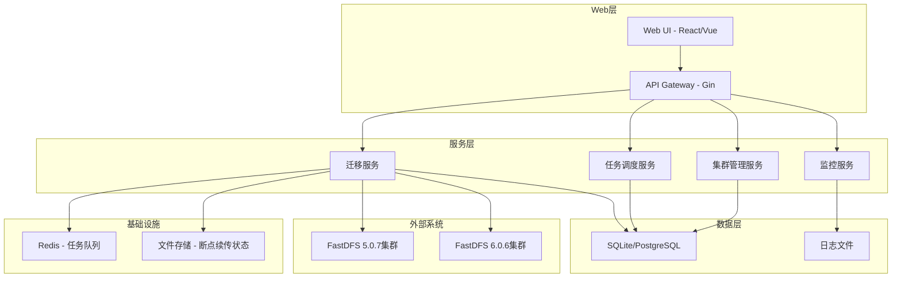

# FastDFS迁移系统设计文档

## 概述

FastDFS迁移系统是一个基于Go语言开发的Web应用，用于管理FastDFS 5.0.7到6.0.6的数据迁移。系统采用微服务架构，支持高并发文件传输、断点续传、定时任务调度等功能。

## 架构设计

### 整体架构



### 技术栈选择

- **后端框架**: Gin (轻量级、高性能HTTP框架)
- **数据库**: SQLite (开发/小规模) 或 PostgreSQL (生产环境)
- **缓存/队列**: Redis (任务队列、会话管理)
- **任务调度**: Cron (定时任务调度)
- **FastDFS客户端**: go-fastdfs-client 或自定义实现
- **前端**: 静态文件服务 (HTML/CSS/JS)
- **日志**: logrus 或 zap
- **配置管理**: viper
- **数据库ORM**: GORM

## 组件和接口

### 1. 核心服务组件

#### 迁移引擎 (MigrationEngine)
```go
type MigrationEngine struct {
    sourceClient   *fastdfs.Client
    targetClient   *fastdfs.Client
    taskQueue      *TaskQueue
    progressTracker *ProgressTracker
    resumeManager  *ResumeManager
}

type MigrationTask struct {
    ID          string
    SourcePath  string
    TargetPath  string
    FileSize    int64
    Status      TaskStatus
    Progress    float64
    CreatedAt   time.Time
    UpdatedAt   time.Time
}
```

#### 任务调度器 (TaskScheduler)
```go
type TaskScheduler struct {
    cronManager *cron.Cron
    taskRepo    TaskRepository
    migrationEngine *MigrationEngine
}

type ScheduledTask struct {
    ID          string
    Name        string
    CronExpr    string
    TaskConfig  MigrationConfig
    NextRun     time.Time
    LastRun     time.Time
    Status      ScheduleStatus
}
```

#### 断点续传管理器 (ResumeManager)
```go
type ResumeManager struct {
    stateStore StateStore
    chunkSize  int64
}

type TransferState struct {
    TaskID       string
    FileID       string
    TotalSize    int64
    TransferredSize int64
    ChunkStates  []ChunkState
    LastUpdate   time.Time
}

type ChunkState struct {
    Index      int
    Offset     int64
    Size       int64
    Completed  bool
    Checksum   string
}
```

### 2. API接口设计

#### REST API端点
```go
// 迁移任务管理
POST   /api/v1/migrations          // 创建迁移任务
GET    /api/v1/migrations          // 获取任务列表
GET    /api/v1/migrations/:id      // 获取任务详情
PUT    /api/v1/migrations/:id      // 更新任务配置
DELETE /api/v1/migrations/:id      // 删除任务
POST   /api/v1/migrations/:id/start   // 启动任务
POST   /api/v1/migrations/:id/pause   // 暂停任务
POST   /api/v1/migrations/:id/resume  // 恢复任务

// 定时任务管理
POST   /api/v1/schedules          // 创建定时任务
GET    /api/v1/schedules          // 获取定时任务列表
PUT    /api/v1/schedules/:id      // 更新定时任务
DELETE /api/v1/schedules/:id      // 删除定时任务

// 集群管理
POST   /api/v1/clusters           // 添加集群配置
GET    /api/v1/clusters           // 获取集群列表
PUT    /api/v1/clusters/:id       // 更新集群配置
DELETE /api/v1/clusters/:id       // 删除集群配置
POST   /api/v1/clusters/:id/test  // 测试集群连接

// 监控和日志
GET    /api/v1/stats              // 获取系统统计信息
GET    /api/v1/logs               // 获取日志信息
GET    /api/v1/progress/:taskId   // 获取任务进度
```

#### WebSocket接口 (实时更新)
```go
// 实时进度推送
WS /ws/progress/:taskId           // 任务进度实时推送
WS /ws/logs                       // 日志实时推送
WS /ws/system-stats               // 系统状态实时推送
```

### 3. 数据访问层

#### 数据库模型
```go
type Migration struct {
    ID           string    `gorm:"primaryKey"`
    Name         string    `gorm:"not null"`
    SourceClusterID string `gorm:"not null"`
    TargetClusterID string `gorm:"not null"`
    Config       MigrationConfig `gorm:"type:json"`
    Status       string    `gorm:"default:'pending'"`
    Progress     float64   `gorm:"default:0"`
    CreatedAt    time.Time
    UpdatedAt    time.Time
    CompletedAt  *time.Time
}

type Cluster struct {
    ID          string `gorm:"primaryKey"`
    Name        string `gorm:"not null"`
    Version     string `gorm:"not null"`
    TrackerAddr string `gorm:"not null"`
    TrackerPort int    `gorm:"not null"`
    Status      string `gorm:"default:'active'"`
    CreatedAt   time.Time
    UpdatedAt   time.Time
}

type TaskLog struct {
    ID        string    `gorm:"primaryKey"`
    TaskID    string    `gorm:"index"`
    Level     string    `gorm:"not null"`
    Message   string    `gorm:"type:text"`
    Details   string    `gorm:"type:json"`
    CreatedAt time.Time
}
```

## 数据模型

### 迁移配置模型
```go
type MigrationConfig struct {
    // 时间过滤
    TimeFilter *TimeFilter `json:"time_filter,omitempty"`
    
    // 文件类型过滤
    FileTypeFilter *FileTypeFilter `json:"file_type_filter,omitempty"`
    
    // 增量同步配置
    IncrementalSync bool `json:"incremental_sync"`
    
    // 并发配置
    ConcurrentWorkers int `json:"concurrent_workers"`
    
    // 重试配置
    RetryConfig *RetryConfig `json:"retry_config"`
    
    // 验证配置
    VerificationEnabled bool `json:"verification_enabled"`
}

type TimeFilter struct {
    StartTime *time.Time `json:"start_time,omitempty"`
    EndTime   *time.Time `json:"end_time,omitempty"`
}

type FileTypeFilter struct {
    IncludeExtensions []string `json:"include_extensions,omitempty"`
    ExcludeExtensions []string `json:"exclude_extensions,omitempty"`
    IncludeMimeTypes  []string `json:"include_mime_types,omitempty"`
    ExcludeMimeTypes  []string `json:"exclude_mime_types,omitempty"`
}

type RetryConfig struct {
    MaxRetries    int           `json:"max_retries"`
    RetryInterval time.Duration `json:"retry_interval"`
    BackoffFactor float64       `json:"backoff_factor"`
}
```

## 错误处理

### 错误分类和处理策略

```go
type ErrorType string

const (
    ErrorTypeNetwork     ErrorType = "network"
    ErrorTypePermission  ErrorType = "permission"
    ErrorTypeFileSystem  ErrorType = "filesystem"
    ErrorTypeValidation  ErrorType = "validation"
    ErrorTypeInternal    ErrorType = "internal"
)

type MigrationError struct {
    Type      ErrorType `json:"type"`
    Code      string    `json:"code"`
    Message   string    `json:"message"`
    Details   string    `json:"details,omitempty"`
    Retryable bool      `json:"retryable"`
    Timestamp time.Time `json:"timestamp"`
}

// 错误处理策略
type ErrorHandler struct {
    retryPolicy   RetryPolicy
    alertManager  AlertManager
    logManager    LogManager
}
```

### 重试机制
- **网络错误**: 指数退避重试，最大重试3次
- **权限错误**: 立即失败，记录日志
- **文件系统错误**: 重试1次，失败后跳过
- **验证错误**: 立即失败，标记为需要人工处理

## 测试策略

### 单元测试
- **覆盖率目标**: 80%以上
- **测试框架**: Go标准testing包 + testify
- **Mock工具**: gomock 或 testify/mock

### 集成测试
- **FastDFS客户端测试**: 使用Docker容器搭建测试环境
- **数据库测试**: 使用内存SQLite进行测试
- **API测试**: 使用httptest包进行HTTP接口测试

### 性能测试
- **并发测试**: 模拟多个并发迁移任务
- **大文件测试**: 测试GB级文件的断点续传
- **长时间运行测试**: 24小时稳定性测试

### 测试数据准备
```go
type TestDataManager struct {
    sourceCluster *testCluster
    targetCluster *testCluster
    testFiles     []TestFile
}

type TestFile struct {
    Path     string
    Size     int64
    Content  []byte
    Checksum string
}
```

## 部署和配置

### 配置文件结构
```yaml
# config.yaml
server:
  port: 8080
  host: "0.0.0.0"
  
database:
  type: "sqlite" # or "postgresql"
  dsn: "./migration.db"
  
redis:
  addr: "localhost:6379"
  password: ""
  db: 0
  
migration:
  default_workers: 5
  chunk_size: 1048576  # 1MB
  max_retry: 3
  
logging:
  level: "info"
  file: "./logs/migration.log"
  max_size: 100  # MB
  max_backups: 5
```

### Docker部署
```dockerfile
FROM golang:1.21-alpine AS builder
WORKDIR /app
COPY . .
RUN go mod download
RUN go build -o migration-system ./cmd/server

FROM alpine:latest
RUN apk --no-cache add ca-certificates
WORKDIR /root/
COPY --from=builder /app/migration-system .
COPY --from=builder /app/web ./web
COPY --from=builder /app/config.yaml .
EXPOSE 8080
CMD ["./migration-system"]
```

## 安全考虑

### 认证和授权
- **基础认证**: HTTP Basic Auth 或 JWT Token
- **权限控制**: 基于角色的访问控制(RBAC)
- **API限流**: 防止API滥用

### 数据安全
- **传输加密**: HTTPS/TLS
- **敏感信息**: 集群密码等敏感信息加密存储
- **审计日志**: 记录所有关键操作

### 网络安全
- **防火墙配置**: 只开放必要端口
- **内网部署**: 建议部署在内网环境
- **访问控制**: IP白名单机制